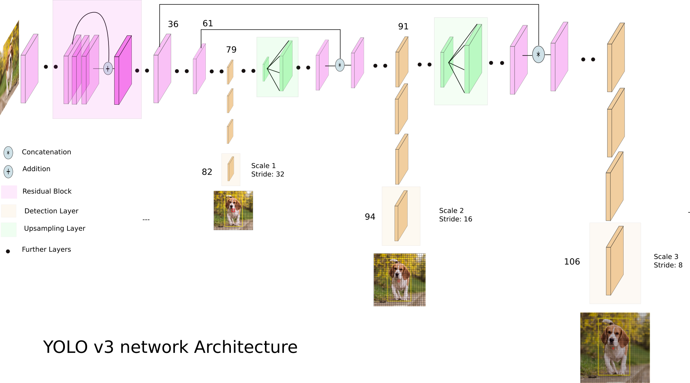

# face-detection-yolov3-keras

## Overview of the project


The YOLOv3 (You Only Look Once) is a state-of-the-art, real-time object detection algorithm. The published model recognizes 80 different objects in images and videos. For more details, you can refer to this [paper](https://pjreddie.com/media/files/papers/YOLOv3.pdf).
The official [DarkNet GitHub](https://github.com/pjreddie/darknet) repository contains the source code for the YOLO versions mentioned in the papers, written in C. The repository provides a step-by-step tutorial on how to use the code for object detection.
Instead of developing this code from scratch, we can use a third-party implementation. There are many third-party implementations designed for using YOLO with Keras.

The basic steps follwed were
* For making the model the pre trained wight file which is trained on the [WIDER FACE: A Face Detection Benchmark](http://mmlab.ie.cuhk.edu.hk/projects/WIDERFace/index.html) dataset from this [link](https://drive.google.com/file/d/1xYasjU52whXMLT5MtF7RCPQkV66993oR/view?usp=sharing) was used.
* Write a Keras model that has the right number and type of layers to match the downloaded model weights. The model architecture is called a [“DarkNet”](https://github.com/pjreddie/darknet/blob/master/cfg/yolov3.cfg) and was originally loosely based on the VGG-16 model.
* Change the number of filters in the yolo layers to make it a classifier for single class detction, i.e. face.
* Build the model bby loading the model weights using the previously downloaded pretrained weights
* Perform the prediction.

## YOLOv3's architecture



Credit: [Ayoosh Kathuria](https://towardsdatascience.com/yolo-v3-object-detection-53fb7d3bfe6b)

https://github.com/experiencor/keras-yolo3/blob/master/yolo3_one_file_to_detect_them_all.py


## Model Design and Implementation


## Implement this project

### Prerequisites

* Tensorflow
* opencv-python
* opencv-contrib-python
* Numpy
* Keras
* Matplotlib
* Pillow

### I. Setting up [miniconda](https://conda.io/en/latest/):

**Install** [miniconda](http://conda.pydata.org/miniconda.html) on your machine. Detailed instructions:

- **Linux:** http://conda.pydata.org/docs/install/quick.html#linux-miniconda-install
- **Mac:** http://conda.pydata.org/docs/install/quick.html#os-x-miniconda-install
- **Windows:** http://conda.pydata.org/docs/install/quick.html#windows-miniconda-install

**Clone** the repository. 

(You will require Git for this)

```sh
git clone https://github.com/chinmaykumar06/face-detection-yolov3-keras.git
face-detection-yolov3-kera
```

In Windows: After you have cloned the repository in the same folder open the Command Prompt or else the Anaconda Prompt, for Command Promt run activate to activate your base environment.

**Create** my_project_env.  Running this command will create a new `conda` environment named my_project_env.
```
conda create --name my_project_env python =3.7
```

**Download** the dependencies.  Running this command will download the dependencies and libraries in the created environment.
```
pip install -r requirements.txt
````

**Verify** that the environment was created in your environments:
```sh
conda info --envs
```
**If you think some error happend while performing the above process you can clean up the libraries and uninstall athe environment and try again!**

**Cleanup** downloaded libraries (remove tarballs, zip files, etc):
```sh
conda clean -tp
```

**Uninstalling**

To uninstall the environment:
```sh
conda remove --name my_project_env --all
```

**Once you are sure that your environment is installed properly,**

**Activate** the enoviornment.  Running this command will activate the created environment where you can install the dependencies.
`````
conda activate my_project_env
`````

To exit the environment when you have completed your work session, simply close the terminal window.


## Usage

* Clone this repository
```bash
$ git clone git clone https://github.com/chinmaykumar06/face-detection-yolov3-keras.git
```

* For face detection, you should download the pre-trained YOLOv3 weights file which trained on the [WIDER FACE: A Face Detection Benchmark](http://mmlab.ie.cuhk.edu.hk/projects/WIDERFace/index.html) dataset from this [link](https://drive.google.com/file/d/1xYasjU52whXMLT5MtF7RCPQkV66993oR/view?usp=sharing) and place it in the `model-weights/` directory.

* Run the following command:

>**image input**
```bash
$ python yoloface.py --image samples/outside_000001.jpg --output-dir outputs/
```
